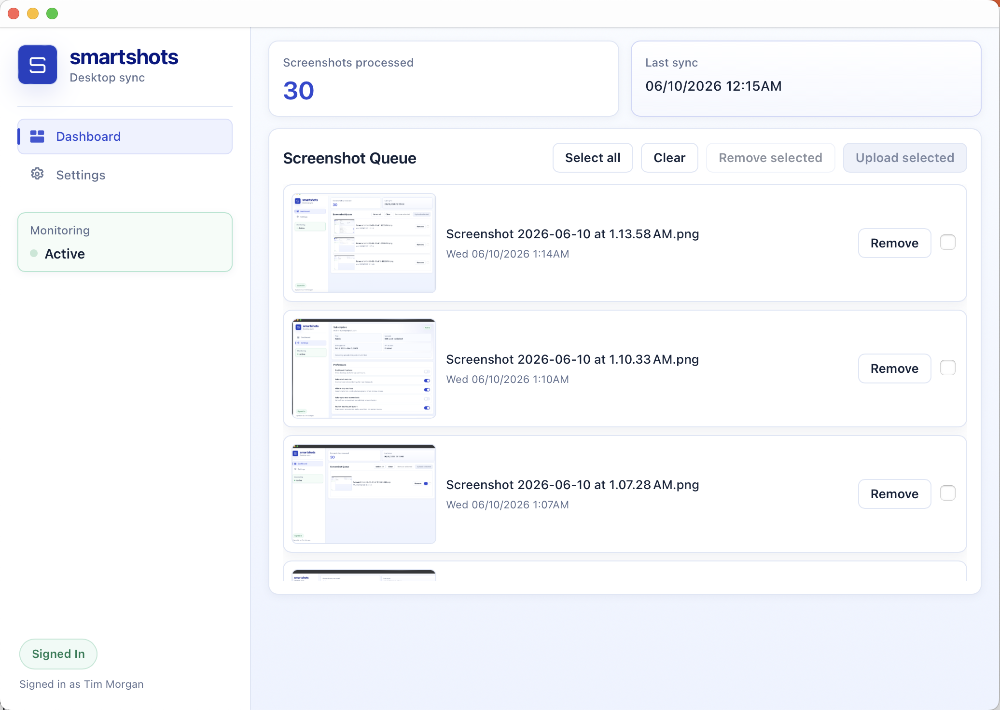

# Smartshots Desktop (Tauri)

Smartshots Desktop is a cross-platform tray app (macOS + Windows) for syncing screenshots to Smartshots.

<p align="center">
  
</p>

Core flow:
1. Sign in with Google via Supabase OAuth.
2. Monitor default screenshot folders.
3. Compress screenshots client-side.
4. Upload to the Smartshots API with a Supabase bearer token.

## Current UI

The app uses a custom frameless window with three primary pages:
1. `Dashboard`
2. `Processing History`
3. `Settings`

Dashboard:
1. Upload progress module (animated while active, completion flash)
2. Backlog review queue (select/clear/upload/ignore)
3. Auth action buttons (sign in/sign out)

Processing History:
1. Recently synced images list
2. Hydrated from persisted upload history on startup

Settings:
1. Notification, watcher, and sync preferences
2. Default screenshot directories
3. Watcher start/stop control

Sidebar:
1. Navigation with active-state indicator
2. Monitoring status card (`Stopped` / pulsing `Active`)

## Quick Start

```bash
npm install
cp .env.example .env
# Required: VITE_SUPABASE_URL, VITE_SUPABASE_ANON_KEY
# Optional: VITE_API_BASE_URL, VITE_OAUTH_REDIRECT
npm run tauri:dev
```

Build:

```bash
npm run tauri:build
```

## Authentication (Detailed)

The auth system is Supabase Auth + Google OAuth, handled in desktop-safe flow.

### 1) Sign-in Start

When the user clicks sign in:
1. Frontend asks Rust for redirect URL via `get_oauth_redirect_url`.
2. Frontend calls Supabase `signInWithOAuth` with:
   - `provider: "google"`
   - `skipBrowserRedirect: true`
   - PKCE-compatible desktop redirect
3. Returned provider URL is opened in the default browser.

Primary implementation lives in:
1. `src/supabaseService.ts`
2. `src/main.ts`

### 2) Callback Capture

The app accepts OAuth completion from:
1. Deep-link callback events (`smartshots://...`) through Tauri deep-link plugin
2. Local loopback callback (`http://127.0.0.1:38965/auth/callback`) bridged by the Rust side

Frontend callback listeners:
1. `onOpenUrl(...)`
2. `getCurrent()`
3. `listen("oauth-callback-url", ...)`

Callback handling:
1. If query contains `code`, app exchanges it via Supabase `exchangeCodeForSession`.
2. If fragment contains tokens, app applies them via Supabase `setSession`.

### 3) Session + UI State

The app keeps session state in Supabase client storage and mirrors it to UI:
1. Signed in/out chip in header
2. Signed-in identity label (`name` or `email`)
3. Watcher controls enabled only when authenticated

### 4) API Auth for Uploads

Before upload:
1. App retrieves current session token.
2. App validates/refreshes token if near expiry.
3. Upload request includes `Authorization: Bearer <token>`.

On `401/403` from upload API:
1. App attempts one token refresh.
2. Retries upload once with refreshed token.
3. Surfaces error if retry fails.

### 5) Sign-out

On sign-out:
1. Watcher is stopped first.
2. Supabase session is cleared.
3. UI auth state and signed-in identity are reset.

### Required OAuth Redirect Configuration

In Supabase provider settings, include:
1. `smartshots://auth/callback`
2. `http://127.0.0.1:38965/auth/callback`

`VITE_OAUTH_REDIRECT` should match your intended desktop callback mode.

## Upload Behavior

Upload endpoint:
1. `POST /api/screenshots`

Body format:
1. Multipart form-data
2. `screenshots` file part
3. `metadata` JSON part
4. `source` form field

Source values sent by platform:
1. macOS: `mac_app`
2. Windows: `win_app`

Images are compressed before upload (max size/width constraints in `src/supabaseService.ts`).

## Processing History

Recent synced items are tracked in persisted store (`upload-history.json`) and shown in `Processing History`.

History persistence behavior:
1. Successful uploads are recorded with timestamp.
2. History is pruned by age and maximum entry count.
3. On app init, recent uploaded records hydrate the UI list.

Implementation:
1. `src/uploadHistory.ts`
2. `src/main.ts` (history hydration + render)

## Project Structure

1. `src-tauri/src/main.rs`
   - tray + native commands
   - screenshot watcher
   - OAuth callback bridge events
2. `src/main.ts`
   - app state + view routing
   - UI bindings/events
   - watcher lifecycle + upload orchestration
3. `src/supabaseService.ts`
   - Supabase auth client
   - token/session handling
   - compression + API upload
4. `src/uploadHistory.ts`
   - persisted upload/ignore/failure records
   - unprocessed filtering + recent upload retrieval

## Icons

Generate the full icon set from a source image (PNG or SVG):

```bash
npx tauri icon src/assets/smartshots-logo.png
```

This creates `icon.icns` (macOS app), `icon.ico` (Windows), and various PNG sizes in `src-tauri/icons/`.

Tray icon: the app uses `icons/32x32.png` for the menu bar. Update `main.rs` to change this.

## Installer Builds

Installer packaging is driven by:

```bash
npm run tauri:build
```

For a local signed/notarized macOS release build:

```bash
npm run release:mac
```

Local build outputs:
1. Windows: installer bundles under `src-tauri/target/release/bundle/`
2. macOS: `.app` bundle, `.dmg`, and updater archive outputs under `src-tauri/target/release/bundle/`

Practical guidance:
1. `npm run tauri:build` is the local packaging entrypoint for both platforms.
2. macOS distribution builds intended for other users should be signed and notarized.
3. Unsigned or non-notarized macOS builds may open locally for development, but can be blocked by Gatekeeper when downloaded on another Mac.
4. `npm run release:mac` is the recommended local path for Mac release builds when the signing certificate is already installed in your login Keychain.

### Local macOS Release Setup

The local release script at [`scripts/build-macos-release.sh`](scripts/build-macos-release.sh) assumes:
1. you are running on macOS
2. your `Developer ID Application` certificate is already installed in Keychain Access
3. the environment variables below are available in your shell or in ignored local env files

The script automatically loads these ignored files when present:
1. `.env.local`
2. `.env.release.local`

Required local environment variables:
1. `VITE_SUPABASE_URL`
2. `VITE_SUPABASE_ANON_KEY`
3. `APPLE_SIGNING_IDENTITY`
4. `APPLE_ID`
5. `APPLE_PASSWORD`
6. `APPLE_TEAM_ID`

Suggested use:
1. Put app config in `.env.local`
2. Put release-only Apple values in `.env.release.local`
3. Run `npm run release:mac`

Notes:
1. `APPLE_PASSWORD` must be an app-specific password from `appleid.apple.com`
2. The script validates that the signing identity exists in your local keychain before starting the Tauri build

## GitHub Actions Builds

The repo includes a GitHub Actions workflow at [`.github/workflows/build-installers.yml`](.github/workflows/build-installers.yml) that builds both Windows installers and a macOS DMG.

Artifact outputs:
1. Windows artifact `windows-build`
2. macOS artifact `macos-dmg`

macOS files uploaded from the runner:
1. `src-tauri/target/release/bundle/dmg/*.dmg`
2. `src-tauri/target/release/bundle/macos/*.app.tar.gz`

Required GitHub repository secrets:
1. `VITE_SUPABASE_URL`
2. `VITE_SUPABASE_ANON_KEY`

Additional macOS signing/notarization secrets:
1. `APPLE_CERTIFICATE`
   Base64-encoded exported `.p12` for the `Developer ID Application` certificate
2. `APPLE_CERTIFICATE_PASSWORD`
   Password used when exporting the `.p12`
3. `APPLE_SIGNING_IDENTITY`
   Full signing identity string, typically `Developer ID Application: Name (TEAMID)`
4. `KEYCHAIN_PASSWORD`
   Throwaway password used by GitHub Actions for the temporary build keychain
5. `APPLE_ID`
   Apple Account email used for notarization
6. `APPLE_PASSWORD`
   App-specific password from `appleid.apple.com`, not the normal Apple Account password
7. `APPLE_TEAM_ID`
   Apple Developer Team ID associated with the signing identity and notarization account

Optional GitHub repository variables:
1. `VITE_SUPABASE_BUCKET`
2. `VITE_API_BASE_URL`
3. `VITE_OAUTH_REDIRECT`

Trigger options:
1. Push to a branch whose name matches `*release*`
2. Run manually with `workflow_dispatch`

Notes:
1. GitHub Actions artifacts are downloaded as a zip container even when the macOS installer inside is a `.dmg`.
2. A notarization failure with `HTTP status code: 401` usually means one of `APPLE_ID`, `APPLE_PASSWORD`, or `APPLE_TEAM_ID` does not match. The password must be an app-specific password.
